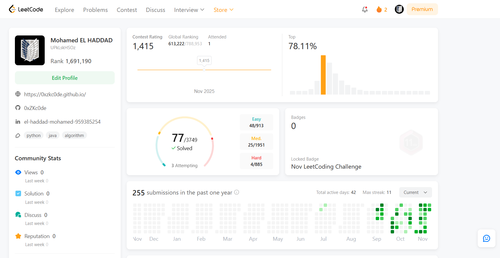

# LeetCode Solutions

A comprehensive collection of my LeetCode problem solutions, organized by difficulty level. This repository serves as a record of my progress in mastering data structures and algorithms through deliberate practice.

## LeetCode Profile

**[View My LeetCode Profile](https://leetcode.com/u/UPkLskHSOz/)**

## Statistics



## Repository Structure

The repository is organized by problem difficulty, with each problem stored in its own numbered directory:
```
leetcode/
├── contest/
│   └── first_context(474)/Q
├── easy/
│   ├── 1143/
│   ├── 118/
│   ├── 121/
│   └── ...
└── medium/
    ├── 1513/
    ├── 19/
    ├── 2/
    └── ...
```

- **easy/** - Easy difficulty problems
- **medium/** - Medium difficulty problems
- **Hard/** - Hard difficulty problems
- **contest/** - Solutions from LeetCode contests

Each directory is named after the problem number and contains the solution implementation.

## Technology

**Python 3** - All solutions are implemented in Python 3, focusing on clean, efficient code with clear algorithmic thinking.

## Problem Count

- **Easy**: 27 problems
- **Medium**: 17 problems
- **Hard**: 1 problem
- **Contest**: 1 contest participation

## Objectives

This repository aims to:

- Document systematic progress through LeetCode's problem set
- Provide a reference for revisiting problem-solving techniques
- Demonstrate proficiency in algorithmic problem-solving
- Build a portfolio of practical coding skills

## About

These solutions reflect my approach to each problem, emphasizing clarity and efficiency. I continuously refine my solutions as I learn new techniques and patterns.

---

**Last Updated**: November 2025
